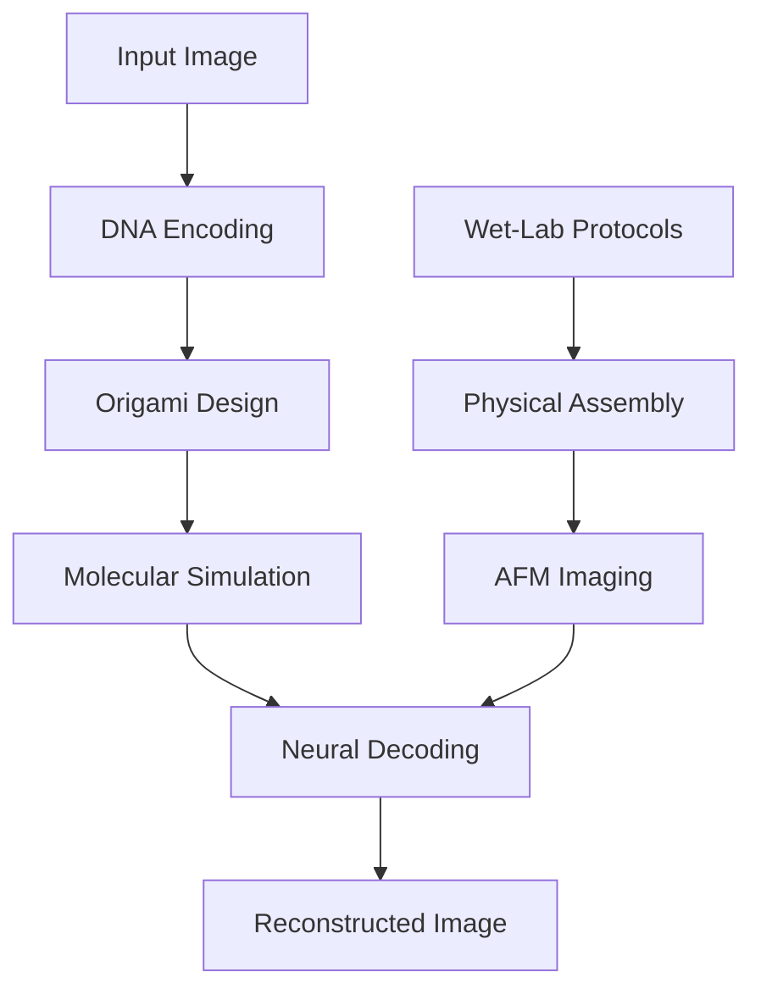

# DNA-Origami-AutoEncoder Architecture

## System Overview

The DNA-Origami-AutoEncoder is a sophisticated "wet-lab ML" framework that bridges synthetic biology and machine learning through four main pipeline stages:



## Core Components Architecture

### 1. Encoding Layer (`dna_origami_ae/encoding/`)

**Purpose**: Convert digital information to DNA sequences with biological constraints

**Key Components**:
- **ImageEncoder**: Transforms 8-bit grayscale images to base-4 DNA sequences
- **ErrorCorrection**: Implements Reed-Solomon and DNA-optimized error correction
- **BiologicalConstraints**: Ensures GC content, avoids problematic sequences
- **Compression**: DNA-compatible data compression algorithms

**Data Flow**:
```
Image Array → Bit Stream → Base-4 Encoding → Constraint Validation → Error-Protected DNA
```

### 2. Design Layer (`dna_origami_ae/design/`)

**Purpose**: Generate DNA origami structures that encode information spatially

**Key Components**:
- **OrigamiDesigner**: Creates scaffold/staple designs for target shapes
- **ShapeLibrary**: Pre-validated origami geometries and patterns
- **SequenceOptimizer**: Minimizes secondary structures and folding conflicts
- **3D Designer**: Handles complex three-dimensional origami structures

**Architecture Pattern**: Factory + Strategy
- Factory creates appropriate designer based on target shape
- Strategy pattern handles different routing algorithms (honeycomb, square lattice)

### 3. Simulation Layer (`dna_origami_ae/simulation/`)

**Purpose**: Predict DNA origami folding through molecular dynamics

**Key Components**:
- **MDSimulator**: GPU-accelerated all-atom molecular dynamics
- **CoarseGrainedModel**: Fast approximate folding prediction
- **oxDNAInterface**: Integration with oxDNA simulation engine
- **ForceField**: Configurable molecular force field parameters

**Performance Architecture**:
- **GPU Acceleration**: CUDA-based parallel simulation
- **Batch Processing**: Multiple structures simulated simultaneously
- **Adaptive Timesteps**: Dynamic time stepping for stability
- **Memory Management**: Efficient trajectory storage and analysis

### 4. Decoding Layer (`dna_origami_ae/decoding/`)

**Purpose**: Extract information from folded structures using neural networks

**Key Components**:
- **TransformerDecoder**: 3D-aware transformer for structure analysis
- **AttentionLayers**: Custom attention mechanisms for spatial relationships
- **TrainingPipeline**: Self-supervised and supervised learning workflows
- **ModelRegistry**: Version control and deployment for trained models

**Neural Architecture**:
```
3D Structure Points → 3D Positional Encoding → Multi-Head Attention → 
Feed-Forward → Output Projection → Reconstructed Image
```

## Data Flow Architecture

### Forward Pipeline (Encoding)
1. **Input Processing**: Image normalization and preprocessing
2. **Digital Encoding**: Bit-level representation with error correction
3. **DNA Sequence Generation**: Base-4 encoding with biological constraints
4. **Spatial Mapping**: Sequence-to-structure mapping via origami design
5. **Validation**: Structural feasibility and constraint checking

### Reverse Pipeline (Decoding)
1. **Structure Acquisition**: Either simulated or experimentally measured
2. **Feature Extraction**: 3D coordinate extraction and normalization
3. **Neural Processing**: Transformer-based pattern recognition
4. **Information Recovery**: Sequence reconstruction from spatial patterns
5. **Error Correction**: Application of redundancy codes
6. **Image Reconstruction**: Final digital image recovery

## Scalability Architecture

### Horizontal Scaling
- **Microservices**: Independent scaling of encoding, simulation, and decoding
- **Container Orchestration**: Kubernetes-based deployment
- **Load Balancing**: Distribute computation across GPU clusters
- **Async Processing**: Queue-based batch processing

### Vertical Scaling
- **GPU Utilization**: Multi-GPU molecular dynamics simulation
- **Memory Optimization**: Streaming large trajectory datasets
- **Compute Optimization**: Mixed-precision training and inference

## Quality Assurance Architecture

### Testing Strategy
- **Unit Tests**: Component-level validation
- **Integration Tests**: End-to-end pipeline testing
- **Performance Tests**: Benchmarking encoding/decoding accuracy
- **Simulation Tests**: Molecular dynamics validation against experimental data

### Monitoring & Observability
- **Metrics Collection**: Performance, accuracy, and resource utilization
- **Distributed Tracing**: Request flow through microservices
- **Health Checks**: Component availability and performance monitoring
- **Error Tracking**: Centralized logging and error analysis

## Security Architecture

### Data Security
- **Input Validation**: Sanitization of image inputs and parameters
- **Access Control**: Role-based access to computational resources
- **Audit Logging**: Comprehensive logging of all operations
- **Secrets Management**: Secure handling of API keys and credentials

### Computational Security
- **Resource Limits**: Prevention of resource exhaustion attacks
- **Container Security**: Minimal attack surface with distroless images
- **Network Security**: TLS encryption for all inter-service communication

## Integration Architecture

### External Systems
- **Laboratory Information Management Systems (LIMS)**: Protocol integration
- **Cloud Platforms**: AWS/GCP for scalable computation
- **Experimental Equipment**: AFM, DNA synthesizers, plate readers
- **Databases**: Sequence databases, experimental results storage

### API Design
- **REST APIs**: Standard HTTP interfaces for web integration
- **GraphQL**: Flexible querying for complex data relationships
- **Streaming APIs**: Real-time updates for long-running simulations
- **SDK Libraries**: Python, R, and JavaScript client libraries

## Deployment Architecture

### Development Environment
- **Container-based**: Docker for consistent development environments
- **Infrastructure as Code**: Terraform for reproducible deployments
- **CI/CD Pipeline**: Automated testing and deployment
- **Feature Flags**: Safe rollout of new functionality

### Production Environment
- **Multi-Region**: Global deployment for reduced latency
- **Auto-Scaling**: Dynamic resource allocation based on demand
- **Disaster Recovery**: Cross-region backup and failover
- **Blue-Green Deployment**: Zero-downtime updates

## Future Architecture Considerations

### Research Extensions
- **In Vivo Integration**: Cellular folding simulation capabilities
- **Multi-Modal Learning**: Integration of multiple experimental techniques
- **Quantum Computing**: Quantum simulation of molecular dynamics
- **Federated Learning**: Distributed model training across institutions

### Technology Evolution
- **Edge Computing**: Local processing for laboratory equipment
- **5G/6G Integration**: High-bandwidth real-time data streaming
- **AI/ML Advances**: Integration of next-generation neural architectures
- **Biotechnology Integration**: Direct coupling with automated lab systems